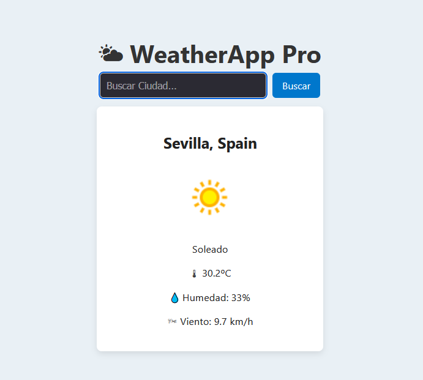

# 🌤️ WeatherApp Pro

Aplicación web para consultar el clima en tiempo real usando la API de [WeatherAPI.com](https://www.weatherapi.com/).




## 🚀 Tecnologías utilizadas
- React
- Vite
- CSS (estilos personalizados)
- Axios
- WeatherAPI

## 🔧 Funcionalidades
- Búsqueda de clima por ciudad
- Muestra temperatura, humedad, viento e icono
- Guarda la última ciudad buscada
- Diseño responsive y animaciones suaves
- Manejo de errores

## 📦 Instalación local
```bash
git clone https://github.com/Ispaluan84/weatherapp-pro.git
cd weatherapp-pro
npm install
npm run dev


"# weatherapp-pro" 
